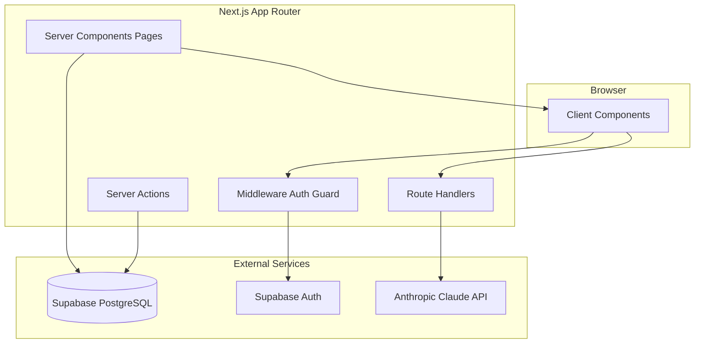
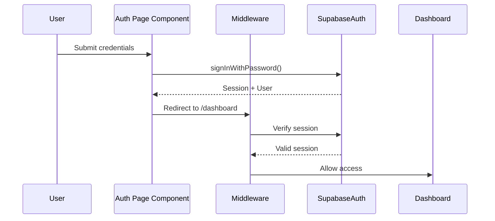
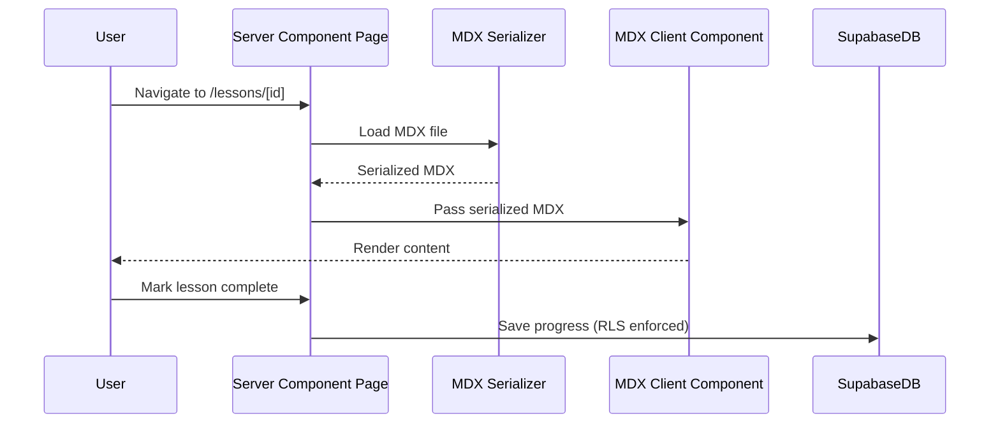
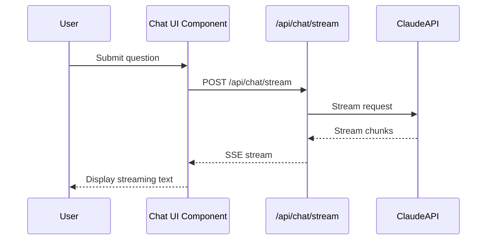

# Design Document

---
**Purpose**: Provide sufficient detail to ensure implementation consistency across different implementers, preventing interpretation drift.

**Approach**:
- Include essential sections that directly inform implementation decisions
- Omit optional sections unless critical to preventing implementation errors
- Match detail level to feature complexity
- Use diagrams and tables over lengthy prose

**Warning**: Approaching 1000 lines indicates excessive feature complexity that may require design simplification.
---

> Sections may be reordered (e.g., surfacing Requirements Traceability earlier or moving Data Models nearer Architecture) when it improves clarity. Within each section, keep the flow **Summary → Scope → Decisions → Impacts/Risks** so reviewers can scan consistently.

## Overview 

KZ-Code は、AI駆動開発（AI-DLC）における基礎理論・設計原理を体系的に学ぶための日本語学習アプリケーションである。
開発者が AI と協働する上で必要な知識体系を、インタラクティブなコンテンツ・AI アシスタント・図解を通じて習得できる環境を提供する。

**Purpose**: この機能は、日本語ネイティブな学習体験と AI 支援による効率的な学習を実現し、開発者の AI 駆動開発スキル向上を支援する。

**Users**: AI 駆動開発を学びたい開発者が、基礎理論から実践的な設計原理まで段階的に学習する。

**Impact**: 現在のプロジェクトは基本的な Next.js セットアップと認証ミドルウェアのみが実装されている状態から、完全な学習プラットフォームへと拡張される。

### Goals
- ユーザー認証・オンボーディング・ダッシュボード・学習コンテンツ配信・AI アシスタント・進捗管理の統合実装
- Next.js App Router の Server Component を活用したパフォーマンス最適化
- Supabase RLS によるセキュアなデータアクセス制御
- 日本語 UI と MDX コンテンツによる学習体験の提供

### Non-Goals
- マルチテナント機能（単一組織向け）
- リアルタイムコラボレーション機能
- モバイルアプリ（Web アプリのみ）
- 外部 LMS システムとの統合

## Architecture

### Existing Architecture Analysis

現在のコードベースは以下のパターンが確立されている：

- **Next.js App Router**: ファイルシステムベースルーティング、Server Component 優先
- **Supabase SSR ミドルウェア**: `middleware.ts` で認証ガードを一元管理
- **認証フロー**: 未認証ユーザーは `/login` へ、認証済みユーザーは `/dashboard` へリダイレクト
- **ルーティング**: ルート `/` は `/dashboard` へリダイレクト

既存パターンを尊重し、認証ページ・ダッシュボード・学習コンテンツ・AI アシスタントを段階的に追加する。

### Architecture Pattern & Boundary Map



**Architecture Integration**:
- **Selected pattern**: Feature-First (App Router) パターン。Next.js App Router のファイルシステムルーティングに従い、ルートごとにコンポーネントをコロケーション
- **Domain/feature boundaries**: 
  - **認証ドメイン**: `/login`, `/signup`, `/reset-password` — Supabase Auth に委譲
  - **学習ドメイン**: `/dashboard`, `/courses`, `/lessons` — コンテンツ配信と進捗管理
  - **AI ドメイン**: `/api/chat` — Claude API 統合
- **Existing patterns preserved**: 
  - Server Component 優先、Client Component は必要最小限
  - ミドルウェアによる認証ガード一元管理
  - パスエイリアス `@/` によるインポート
- **New components rationale**: 
  - 認証ページコンポーネント（要件 1）
  - ダッシュボード・オンボーディング UI（要件 2, 3）
  - MDX コンテンツレンダラー（要件 4）
  - AI チャット UI とストリーミング処理（要件 5）
  - 進捗管理サービス（要件 6）
  - Mermaid ダイアグラムレンダラー（要件 7）
- **Steering compliance**: 
  - Server-first コンポーネント設計
  - TypeScript strict mode
  - Tailwind CSS v4 によるスタイリング
  - Supabase SSR ミドルウェアパターン

### Technology Stack & Alignment

| Layer | Choice / Version | Role in Feature | Notes |
|-------|------------------|-----------------|-------|
| Frontend | Next.js 16.1.6 (App Router) | ページルーティング・Server Component | 既存スタック |
| Frontend | React 19.2.3 | UI ライブラリ | 既存スタック |
| Frontend | TypeScript 5.7.2 (strict) | 型安全性 | 既存スタック |
| Frontend | Tailwind CSS v4 | スタイリング | 既存スタック |
| Frontend | Framer Motion 11.11.17 | アニメーション・トランジション | 要件 8.4 |
| Frontend | Zustand 5.0.2 | クライアント状態管理 | 既存スタック |
| Frontend | next-mdx-remote 4.4.1 | MDX コンテンツレンダリング | 要件 4.1 |
| Frontend | mermaid 11.4.0 | ダイアグラム描画 | 要件 7.1 |
| Backend | Supabase Auth (via @supabase/ssr 0.5.2) | 認証・セッション管理 | 要件 1 |
| Backend | Supabase PostgreSQL | データ永続化（ユーザー・進捗・コンテンツメタデータ） | 要件 6 |
| Backend | Anthropic Claude API (@anthropic-ai/sdk 0.34.2) | AI 学習アシスタント | 要件 5 |
| Infrastructure | Node.js 20+ | ランタイム | 既存スタック |

詳細な技術選定の根拠と比較は `research.md` を参照。

## System Flows

### Authentication Flow



**Key Decisions**: 
- ミドルウェアでセッション検証を一元化し、各ページでの重複チェックを回避
- Cookie ベースのセッション管理により SSR とクライアント間でセッションを同期

### Learning Content Flow



**Key Decisions**: 
- Server Component で MDX をシリアライズし、バンドルサイズを削減
- Client Component でレンダリングし、インタラクティブ要素をサポート

### AI Assistant Streaming Flow



**Key Decisions**: 
- Route Handler を使用して Server Actions のタイムアウト制限を回避
- Server-Sent Events (SSE) または ReadableStream でストリーミング実装

## Requirements Traceability

| Requirement | Summary | Components | Interfaces | Flows |
|-------------|---------|------------|------------|-------|
| 1.1 | サインアップ | AuthService, SignUpPage | AuthService.signUp() | Authentication Flow |
| 1.2 | ログイン | AuthService, LoginPage | AuthService.signIn() | Authentication Flow |
| 1.3 | パスワードリセット | AuthService, ResetPasswordPage | AuthService.resetPassword() | Authentication Flow |
| 1.4 | 未認証リダイレクト | Middleware | Middleware auth guard | Authentication Flow |
| 1.5 | 認証済みリダイレクト | Middleware | Middleware auth guard | Authentication Flow |
| 1.6 | セッション自動更新 | Middleware, SupabaseClient | Cookie refresh | Authentication Flow |
| 2.1 | オンボーディング表示 | OnboardingPage, UserProfileService | UserProfileService.getOnboardingStatus() | - |
| 2.2 | オンボーディング完了 | OnboardingPage, UserProfileService | UserProfileService.completeOnboarding() | - |
| 2.3 | オンボーディング強制 | Middleware | Middleware onboarding check | - |
| 3.1 | ダッシュボード進捗表示 | DashboardPage, ProgressService | ProgressService.getSummary() | - |
| 3.2 | 推奨コンテンツ | DashboardPage, ContentService | ContentService.getRecommended() | - |
| 3.3 | コース一覧 | DashboardPage, ContentService | ContentService.listCourses() | - |
| 4.1 | MDX レンダリング | MDXRenderer, MDXSerializer | MDXSerializer.serialize() | Learning Content Flow |
| 4.2 | レッスンナビゲーション | LessonPage, ContentService | ContentService.getLesson() | Learning Content Flow |
| 4.3 | コンテンツ階層構造 | ContentService | ContentService.getHierarchy() | - |
| 4.4 | レッスン完了記録 | LessonPage, ProgressService | ProgressService.completeLesson() | Learning Content Flow |
| 4.5 | 日本語コンテンツ | ContentService | Content metadata | - |
| 5.1 | AI 質問処理 | ChatRouteHandler, ClaudeService | ClaudeService.streamResponse() | AI Assistant Streaming Flow |
| 5.2 | ストリーミング表示 | ChatUI, ChatRouteHandler | SSE/ReadableStream | AI Assistant Streaming Flow |
| 5.3 | 会話履歴保持 | ChatService, SupabaseDB | ChatService.saveHistory() | - |
| 5.4 | レッスンコンテキスト提供 | ChatRouteHandler, ContentService | ContentService.getLessonContext() | AI Assistant Streaming Flow |
| 5.5 | エラーハンドリング | ChatRouteHandler, ChatUI | Error boundary | AI Assistant Streaming Flow |
| 6.1 | レッスン完了保存 | ProgressService, SupabaseDB | ProgressService.completeLesson() | - |
| 6.2 | 進捗率算出 | ProgressService | ProgressService.calculateProgress() | - |
| 6.3 | レッスンステータス表示 | CoursePage, ProgressService | ProgressService.getLessonStatus() | - |
| 6.4 | 学習履歴永続化 | ProgressService, SupabaseDB | ProgressService.saveHistory() | - |
| 7.1 | Mermaid レンダリング | MermaidRenderer | MermaidRenderer.render() | - |
| 7.2 | MDX 統合 | MDXRenderer, MermaidRenderer | Mermaid code block detection | Learning Content Flow |
| 7.3 | ダークモード対応 | MermaidRenderer | Theme configuration | - |
| 8.1 | レスポンシブレイアウト | All UI Components | Tailwind responsive classes | - |
| 8.2 | ダークモード切り替え | ThemeProvider | ThemeProvider.toggle() | - |
| 8.3 | 日本語フォント | Layout, globals.css | Font configuration | - |
| 8.4 | アニメーション | All UI Components | Framer Motion | - |
| 8.5 | ローディング表示 | Loading components | Suspense boundaries | - |
| 9.1 | エラーバウンダリ | ErrorBoundary | error.tsx | - |
| 9.2 | 404 ページ | NotFoundPage | not-found.tsx | - |
| 9.3 | オフライン通知 | NetworkStatusHook | Network detection | - |
| 9.4 | 日本語エラーメッセージ | ErrorBoundary, API handlers | Error message localization | - |
| 10.1 | Server Component 優先 | All pages | Server Component default | - |
| 10.2 | RLS 有効化 | SupabaseDB | RLS policies | - |
| 10.3 | API キー保護 | Environment variables | Server-only access | - |
| 10.4 | パフォーマンススコア | Lighthouse CI | Performance monitoring | - |
| 10.5 | CI パイプライン | GitHub Actions | ci.yml, e2e.yml | - |

## Components and Interfaces

| Component | Domain/Layer | Intent | Req Coverage | Key Dependencies (P0/P1) | Contracts |
|-----------|--------------|--------|--------------|--------------------------|-----------|
| AuthService | Domain | 認証操作の抽象化 | 1.1, 1.2, 1.3 | SupabaseClient (P0) | Service |
| UserProfileService | Domain | ユーザープロフィール管理 | 2.1, 2.2 | SupabaseDB (P0) | Service |
| ContentService | Domain | 学習コンテンツ取得・管理 | 3.2, 3.3, 4.2, 4.3, 4.5, 5.4 | FileSystem (P0), SupabaseDB (P1) | Service |
| ProgressService | Domain | 学習進捗管理 | 3.1, 6.1, 6.2, 6.3, 6.4 | SupabaseDB (P0) | Service |
| ClaudeService | Domain | Claude API 統合 | 5.1, 5.4 | Anthropic SDK (P0) | Service |
| ChatService | Domain | AI チャット会話管理 | 5.3 | SupabaseDB (P0) | Service |
| MDXSerializer | Infrastructure | MDX コンテンツシリアライズ | 4.1 | next-mdx-remote (P0) | Service |
| LoginPage | UI | ログインフォーム | 1.2 | AuthService (P0) | - |
| SignUpPage | UI | サインアップフォーム | 1.1 | AuthService (P0) | - |
| ResetPasswordPage | UI | パスワードリセットフォーム | 1.3 | AuthService (P0) | - |
| OnboardingPage | UI | オンボーディングフロー | 2.1, 2.2 | UserProfileService (P0) | - |
| DashboardPage | UI | ダッシュボード表示 | 3.1, 3.2, 3.3 | ProgressService (P0), ContentService (P0) | - |
| LessonPage | UI | レッスンコンテンツ表示 | 4.2, 4.4 | ContentService (P0), ProgressService (P0) | - |
| MDXRenderer | UI | MDX コンテンツレンダリング | 4.1 | MDXSerializer (P0), MermaidRenderer (P1) | - |
| MermaidRenderer | UI | Mermaid ダイアグラム描画 | 7.1, 7.2, 7.3 | mermaid (P0) | - |
| ChatUI | UI | AI チャットインターフェース | 5.2, 5.5 | ChatRouteHandler (P0) | - |
| ChatRouteHandler | Infrastructure | AI ストリーミング API | 5.1, 5.4, 5.5 | ClaudeService (P0) | API |
| Middleware | Infrastructure | 認証ガード・セッション管理 | 1.4, 1.5, 1.6, 2.3 | SupabaseClient (P0) | - |

### Domain / Services

#### AuthService

| Field | Detail |
|-------|--------|
| Intent | Supabase Auth 操作を抽象化し、認証ページから利用可能なインターフェースを提供 |
| Requirements | 1.1, 1.2, 1.3 |

**Responsibilities & Constraints**
- サインアップ・ログイン・パスワードリセット操作を提供
- Supabase Auth のエラーをアプリケーション固有のエラー型に変換
- セッション管理は Supabase SSR クライアントに委譲

**Dependencies**
- Inbound: LoginPage, SignUpPage, ResetPasswordPage — 認証操作のトリガー (P0)
- Outbound: SupabaseClient — 認証 API 呼び出し (P0)

**Contracts**: Service [✓]

##### Service Interface
```typescript
interface AuthService {
  signUp(email: string, password: string): Promise<Result<{ user: User }, AuthError>>;
  signIn(email: string, password: string): Promise<Result<{ user: User }, AuthError>>;
  resetPassword(email: string): Promise<Result<void, AuthError>>;
  signOut(): Promise<Result<void, AuthError>>;
}
```
- Preconditions: メールアドレスは有効な形式、パスワードは最小長要件を満たす
- Postconditions: 成功時はセッション Cookie が設定され、ユーザー情報が返される
- Invariants: 認証状態は Supabase Auth と同期される

**Implementation Notes**
- Integration: Server Actions または Route Handlers から呼び出し
- Validation: メールアドレス・パスワード形式の検証を実装
- Risks: Supabase Auth のレート制限に注意

#### ContentService

| Field | Detail |
|-------|--------|
| Intent | 学習コンテンツ（コース・セクション・レッスン）の取得と階層構造管理 |
| Requirements | 3.2, 3.3, 4.2, 4.3, 4.5, 5.4 |

**Responsibilities & Constraints**
- MDX ファイルの読み込みとメタデータ管理
- コース > セクション > レッスンの階層構造を提供
- 日本語コンテンツの言語検証

**Dependencies**
- Inbound: DashboardPage, LessonPage, ChatRouteHandler — コンテンツ取得要求 (P0)
- Outbound: FileSystem — MDX ファイル読み込み (P0), SupabaseDB — コンテンツメタデータ (P1)

**Contracts**: Service [✓]

##### Service Interface
```typescript
interface ContentService {
  listCourses(): Promise<Course[]>;
  getCourse(courseId: string): Promise<Course | null>;
  getLesson(courseId: string, sectionId: string, lessonId: string): Promise<Lesson | null>;
  getLessonContent(lessonId: string): Promise<string>; // MDX source
  getRecommendedLessons(userId: string): Promise<Lesson[]>;
  getLessonContext(lessonId: string): Promise<string>; // For AI context
}
```

**Implementation Notes**
- Integration: Server Component から呼び出し、ファイルシステムから MDX を読み込み
- Validation: レッスン ID の存在確認、階層構造の整合性チェック
- Risks: 大容量 MDX ファイルの読み込みパフォーマンス

#### ProgressService

| Field | Detail |
|-------|--------|
| Intent | ユーザーの学習進捗（レッスン完了・進捗率・学習履歴）の管理 |
| Requirements | 3.1, 6.1, 6.2, 6.3, 6.4 |

**Responsibilities & Constraints**
- レッスン完了記録の永続化（Supabase RLS で保護）
- コースごとの進捗率算出
- 学習履歴の時系列管理

**Dependencies**
- Inbound: DashboardPage, LessonPage — 進捗更新要求 (P0)
- Outbound: SupabaseDB — 進捗データ永続化 (P0)

**Contracts**: Service [✓], State [✓]

##### Service Interface
```typescript
interface ProgressService {
  completeLesson(userId: string, lessonId: string): Promise<Result<void, ProgressError>>;
  getProgressSummary(userId: string): Promise<ProgressSummary>;
  calculateProgress(userId: string, courseId: string): Promise<number>; // 0-100
  getLessonStatus(userId: string, lessonId: string): Promise<LessonStatus>;
  saveHistory(userId: string, lessonId: string, duration: number): Promise<Result<void, ProgressError>>;
}
```

**Implementation Notes**
- Integration: Server Actions から呼び出し、Supabase RLS ポリシーで保護
- Validation: ユーザー ID とレッスン ID の存在確認
- Risks: 進捗データの整合性（重複完了記録の防止）

#### ClaudeService

| Field | Detail |
|-------|--------|
| Intent | Anthropic Claude API との統合とストリーミング応答処理 |
| Requirements | 5.1, 5.4 |

**Responsibilities & Constraints**
- Claude API へのリクエスト送信とストリーミング応答の処理
- レッスンコンテキストをプロンプトに組み込み
- エラーハンドリングとリトライロジック

**Dependencies**
- Inbound: ChatRouteHandler — AI 質問要求 (P0)
- Outbound: Anthropic SDK — Claude API 呼び出し (P0), ContentService — レッスンコンテキスト取得 (P1)

**Contracts**: Service [✓]

##### Service Interface
```typescript
interface ClaudeService {
  streamResponse(
    messages: ChatMessage[],
    context?: string
  ): Promise<ReadableStream<StreamChunk>>;
}
```

**Implementation Notes**
- Integration: Route Handler から呼び出し、ReadableStream を返す
- Validation: メッセージ履歴の長さ制限、コンテキストサイズ制限
- Risks: Claude API レート制限、タイムアウト、コスト管理

### Infrastructure / Route Handlers

#### ChatRouteHandler

| Field | Detail |
|-------|--------|
| Intent | AI チャットストリーミング API エンドポイント |
| Requirements | 5.1, 5.4, 5.5 |

**Responsibilities & Constraints**
- POST `/api/chat/stream` でストリーミング応答を提供
- レッスンコンテキストを自動的に取得してプロンプトに追加
- エラーハンドリングと適切な HTTP ステータスコード返却

**Dependencies**
- Inbound: ChatUI — ストリーミングリクエスト (P0)
- Outbound: ClaudeService — AI 応答生成 (P0), ContentService — コンテキスト取得 (P1)

**Contracts**: API [✓]

##### API Contract
| Method | Endpoint | Request | Response | Errors |
|--------|----------|---------|----------|--------|
| POST | /api/chat/stream | `{ message: string, lessonId?: string, history?: ChatMessage[] }` | ReadableStream<StreamChunk> | 400, 401, 500 |

**Implementation Notes**
- Integration: Next.js Route Handler (`app/api/chat/stream/route.ts`)
- Validation: リクエストボディの検証、認証チェック
- Risks: ストリーミング中断時のクリーンアップ、レート制限

### UI / Pages

#### LoginPage, SignUpPage, ResetPasswordPage

**Implementation Notes**
- Client Component (`"use client"`) でフォーム状態管理
- AuthService を Server Action 経由で呼び出し
- エラーメッセージの日本語表示

#### DashboardPage

**Implementation Notes**
- Server Component で進捗サマリーとコース一覧を取得
- Client Component でインタラクティブ要素（推奨コンテンツカードなど）を実装

#### LessonPage

**Implementation Notes**
- Server Component でレッスンコンテンツとメタデータを取得
- MDXRenderer（Client Component）にシリアライズ済み MDX を渡す
- レッスン完了ボタンは Server Action で処理

#### MDXRenderer

**Implementation Notes**
- Client Component (`"use client"`) で `<MDXRemote />` を使用
- Mermaid コードブロックを検出して MermaidRenderer に委譲
- カスタムコンポーネント（コードブロック、カスタム要素など）をサポート

#### MermaidRenderer

**Implementation Notes**
- Client Component (`"use client"`) で Mermaid.js をロード
- ダークモード/ライトモードに応じてテーマを切り替え
- 遅延読み込みとメモ化でパフォーマンス最適化

#### ChatUI

**Implementation Notes**
- Client Component (`"use client"`) でチャットインターフェース
- `fetch` で `/api/chat/stream` に接続し、ReadableStream を処理
- ストリーミングテキストのリアルタイム表示
- 会話履歴のローカル状態管理（ChatService で永続化）

## Data Models

### Domain Model

**Aggregates**:
- **User**: ユーザー認証情報（Supabase Auth で管理）、プロフィール情報
- **Course**: コース（複数のセクションを含む）
- **Section**: セクション（複数のレッスンを含む）
- **Lesson**: レッスン（MDX コンテンツ、メタデータ）
- **UserProgress**: ユーザーの学習進捗（レッスン完了記録、学習履歴）

**Entities**:
- `User` (auth.users via Supabase Auth)
- `UserProfile` (profiles table)
- `Course` (courses table)
- `Section` (sections table)
- `Lesson` (lessons table)
- `LessonCompletion` (lesson_completions table)
- `LearningHistory` (learning_history table)
- `ChatConversation` (chat_conversations table)
- `ChatMessage` (chat_messages table)

**Value Objects**:
- `Email`, `Password`, `LessonId`, `CourseId`, `ProgressPercentage`

**Domain Events**:
- `LessonCompleted`, `OnboardingCompleted`, `CourseProgressUpdated`

### Logical Data Model

**Structure Definition**:

```
users (Supabase Auth)
  ├─ id (UUID, PK)
  ├─ email
  └─ created_at

profiles
  ├─ id (UUID, PK, FK → users.id)
  ├─ onboarding_completed (boolean)
  ├─ learning_goal (text)
  ├─ experience_level (text)
  └─ updated_at

courses
  ├─ id (UUID, PK)
  ├─ title (text)
  ├─ description (text)
  ├─ order_index (integer)
  └─ created_at

sections
  ├─ id (UUID, PK)
  ├─ course_id (UUID, FK → courses.id)
  ├─ title (text)
  ├─ order_index (integer)
  └─ created_at

lessons
  ├─ id (UUID, PK)
  ├─ section_id (UUID, FK → sections.id)
  ├─ title (text)
  ├─ content_path (text) -- MDX file path
  ├─ order_index (integer)
  └─ created_at

lesson_completions
  ├─ id (UUID, PK)
  ├─ user_id (UUID, FK → users.id)
  ├─ lesson_id (UUID, FK → lessons.id)
  ├─ completed_at (timestamp)
  └─ UNIQUE(user_id, lesson_id)

learning_history
  ├─ id (UUID, PK)
  ├─ user_id (UUID, FK → users.id)
  ├─ lesson_id (UUID, FK → lessons.id)
  ├─ duration_seconds (integer)
  ├─ accessed_at (timestamp)
  └─ created_at

chat_conversations
  ├─ id (UUID, PK)
  ├─ user_id (UUID, FK → users.id)
  ├─ lesson_id (UUID, FK → lessons.id, nullable)
  ├─ created_at
  └─ updated_at

chat_messages
  ├─ id (UUID, PK)
  ├─ conversation_id (UUID, FK → chat_conversations.id)
  ├─ role (text) -- 'user' | 'assistant'
  ├─ content (text)
  ├─ created_at
  └─ order_index (integer)
```

**Consistency & Integrity**:
- `lesson_completions` は `(user_id, lesson_id)` でユニーク制約
- `profiles.id` は `users.id` と 1:1 関係
- `sections.course_id` と `lessons.section_id` で階層構造を維持
- RLS ポリシーで `user_id = auth.uid()` 条件を適用

### Physical Data Model

**For Supabase PostgreSQL**:

**Tables**:
- `profiles`: `id UUID PRIMARY KEY REFERENCES auth.users(id)`
- `courses`: `id UUID PRIMARY KEY DEFAULT gen_random_uuid()`
- `sections`: `id UUID PRIMARY KEY DEFAULT gen_random_uuid()`, `course_id UUID REFERENCES courses(id) ON DELETE CASCADE`
- `lessons`: `id UUID PRIMARY KEY DEFAULT gen_random_uuid()`, `section_id UUID REFERENCES sections(id) ON DELETE CASCADE`
- `lesson_completions`: `id UUID PRIMARY KEY DEFAULT gen_random_uuid()`, `user_id UUID REFERENCES auth.users(id) ON DELETE CASCADE`, `lesson_id UUID REFERENCES lessons(id) ON DELETE CASCADE`, `UNIQUE(user_id, lesson_id)`
- `learning_history`: `id UUID PRIMARY KEY DEFAULT gen_random_uuid()`, `user_id UUID REFERENCES auth.users(id) ON DELETE CASCADE`, `lesson_id UUID REFERENCES lessons(id) ON DELETE CASCADE`
- `chat_conversations`: `id UUID PRIMARY KEY DEFAULT gen_random_uuid()`, `user_id UUID REFERENCES auth.users(id) ON DELETE CASCADE`, `lesson_id UUID REFERENCES lessons(id) ON DELETE SET NULL`
- `chat_messages`: `id UUID PRIMARY KEY DEFAULT gen_random_uuid()`, `conversation_id UUID REFERENCES chat_conversations(id) ON DELETE CASCADE`

**Indexes**:
- `profiles(user_id)` — ユーザープロフィール取得
- `lesson_completions(user_id, lesson_id)` — 完了状態チェック
- `learning_history(user_id, accessed_at)` — 学習履歴時系列取得
- `chat_messages(conversation_id, order_index)` — 会話メッセージ順序取得

**RLS Policies**:
- `profiles`: `SELECT, UPDATE WHERE auth.uid() = id`
- `lesson_completions`: `SELECT, INSERT WHERE auth.uid() = user_id`
- `learning_history`: `SELECT, INSERT WHERE auth.uid() = user_id`
- `chat_conversations`: `SELECT, INSERT, UPDATE WHERE auth.uid() = user_id`
- `chat_messages`: `SELECT, INSERT WHERE conversation_id IN (SELECT id FROM chat_conversations WHERE user_id = auth.uid())`

### Data Contracts & Integration

**API Data Transfer**:

```typescript
// Chat API Request
interface ChatStreamRequest {
  message: string;
  lessonId?: string;
  history?: ChatMessage[];
}

// Chat API Response (Stream)
interface StreamChunk {
  type: 'content' | 'done' | 'error';
  content?: string;
  error?: string;
}

// Progress API Response
interface ProgressSummary {
  totalLessons: number;
  completedLessons: number;
  progressPercentage: number;
  recentActivity: LearningHistoryEntry[];
}
```

**Event Schemas**: 現時点ではイベント駆動アーキテクチャは採用しない（将来の拡張性を考慮して設計）

## Error Handling

### Error Strategy

**User Errors (4xx)**:
- `400 Bad Request`: 無効なリクエスト（メール形式不正、必須フィールド欠損） → フィールドレベルバリデーションエラーを表示
- `401 Unauthorized`: 未認証アクセス → `/login` へリダイレクト（ミドルウェアで処理）
- `403 Forbidden`: RLS ポリシー違反 → エラーメッセージ表示
- `404 Not Found`: 存在しないリソース（レッスン、コース） → 404 ページ表示

**System Errors (5xx)**:
- `500 Internal Server Error`: サーバーエラー（Supabase 接続失敗、Claude API エラー） → エラーバウンダリでキャッチし、再試行オプションを提供
- `502 Bad Gateway`: 外部サービス（Supabase、Claude API）の障害 → グレースフルデグラデーション（キャッシュされたデータ表示など）

**Business Logic Errors (422)**:
- レッスン重複完了 → 警告メッセージ表示（進捗は更新しない）
- オンボーディング未完了でのダッシュボードアクセス → `/onboarding` へリダイレクト

### Error Categories and Responses

**Process Flow Visualization**:

```mermaid
flowchart TD
    Start[Request] --> Auth{Authenticated?}
    Auth -->|No| Redirect[/login]
    Auth -->|Yes| Validate{Valid Request?}
    Validate -->|No| Error400[400 Bad Request]
    Validate -->|Yes| Process[Process Request]
    Process --> External{External Service}
    External -->|Success| Success[200 OK]
    External -->|Error| Error500[500 Internal Error]
    Error500 --> Retry{Retry Possible?}
    Retry -->|Yes| Process
    Retry -->|No| ErrorBoundary[Error Boundary]
```

### Monitoring

- **Error Tracking**: エラーバウンダリでエラーをキャッチし、コンソールログに記録（将来は Sentry などのエラートラッキングサービス統合を検討）
- **Logging**: Server Actions と Route Handlers で構造化ログを出力
- **Health Monitoring**: `/api/health` エンドポイントで Supabase と Claude API の接続状態を確認

## Testing Strategy

### Unit Tests
- `AuthService.signUp()`, `AuthService.signIn()` — 認証ロジックとエラーハンドリング
- `ProgressService.calculateProgress()` — 進捗率算出ロジック
- `ContentService.getLesson()` — レッスン取得と階層構造検証
- `ClaudeService.streamResponse()` — ストリーミング応答処理（モック）

### Integration Tests
- 認証フロー（サインアップ → ログイン → ダッシュボード） — Supabase Auth 統合
- レッスン完了フロー（レッスン表示 → 完了記録 → 進捗更新） — Supabase DB 統合
- AI チャットフロー（質問送信 → ストリーミング応答 → 履歴保存） — Claude API 統合（モック）

### E2E/UI Tests (Playwright)
- ログインフロー（メール・パスワード入力 → ダッシュボード表示）
- オンボーディングフロー（初回ログイン → オンボーディング完了 → ダッシュボード）
- レッスン閲覧フロー（コース選択 → レッスン表示 → MDX レンダリング → 完了記録）
- AI チャットフロー（質問入力 → ストリーミング表示 → 履歴表示）

### Performance/Load
- MDX コンテンツ読み込み時間（100KB 以上の MDX ファイル）
- ストリーミング応答のレイテンシ（Claude API 応答時間）
- ダッシュボードレンダリング時間（進捗サマリー・コース一覧取得）

## Security Considerations

- **Authentication**: Supabase Auth による JWT ベース認証、Cookie ベースセッション管理
- **Authorization**: Supabase RLS でデータアクセスを制御、`auth.uid() = user_id` 条件でユーザー自身のデータのみアクセス可能
- **API Key Protection**: Claude API キーは環境変数で管理、クライアントサイドに露出しない（Server Actions / Route Handlers のみで使用）
- **Input Validation**: メールアドレス・パスワード形式検証、SQL インジェクション対策（Supabase クライアントが自動処理）
- **XSS Prevention**: MDX コンテンツのサニタイズ（next-mdx-remote が自動処理）

## Performance & Scalability

- **Target Metrics**: Lighthouse パフォーマンススコア 90 以上、First Contentful Paint < 1.5s、Time to Interactive < 3.5s
- **Scaling Approaches**: 
  - Server Component によるバンドルサイズ削減
  - MDX コンテンツのコード分割と遅延読み込み
  - Supabase の自動スケーリング（PostgreSQL と Storage）
- **Caching Strategies**: 
  - Next.js の静的生成（ISR）でコース一覧・レッスンメタデータをキャッシュ
  - Supabase クエリ結果のキャッシュ（SWR または React Query を検討）

## Supporting References

詳細な技術調査と設計決定の根拠は `.kiro/specs/kz-code/research.md` を参照。
