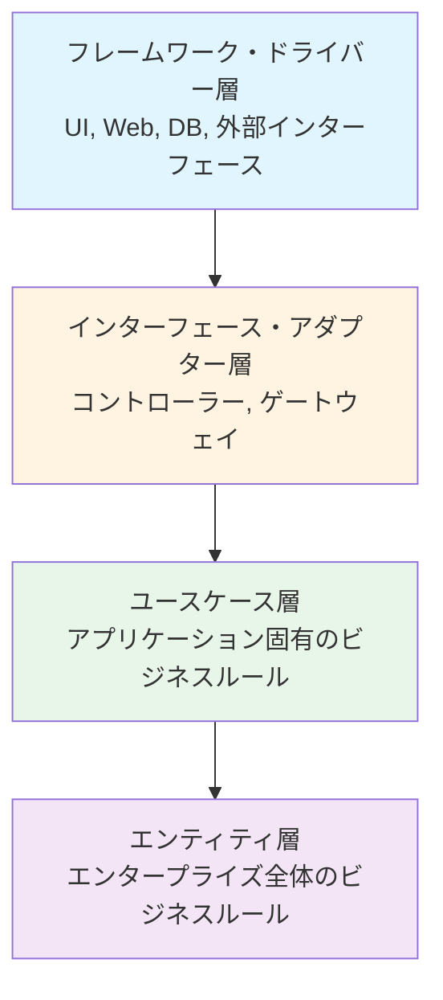

# クリーンアーキテクチャの原則

## はじめに

このレッスンでは、**クリーンアーキテクチャ**の基本原則について学びます。クリーンアーキテクチャは、Robert C. Martinが提唱したアーキテクチャパターンで、テスト容易性と保守性を向上させることを目的としています。

## クリーンアーキテクチャとは

**クリーンアーキテクチャ**は、依存関係の方向を制御し、ビジネスロジックを中心に配置することで、システムの構造を明確にするアーキテクチャパターンです。

### 主な特徴

- **依存関係の逆転**: 外側のレイヤーが内側のレイヤーに依存する
- **ビジネスロジックの独立性**: ビジネスロジックが外部の技術的詳細から独立
- **テスト容易性**: 各レイヤーを独立してテスト可能

## レイヤー構造

クリーンアーキテクチャは、以下のようなレイヤー構造を持ちます：

## 依存関係の原則

クリーンアーキテクチャでは、**依存関係逆転の原則（DIP）**が重要です：

- 外側のレイヤーは内側のレイヤーに依存する
- 内側のレイヤーは外側のレイヤーに依存しない
- インターフェースを通じて依存関係を制御する

## AI開発におけるクリーンアーキテクチャの適用

AI開発においても、クリーンアーキテクチャの原則は有効です：

- **AIモデルをエンティティ層に配置**: AIモデル自体はビジネスロジックの一部
- **API呼び出しをインターフェース層に配置**: 外部のAIサービスへのアクセスを抽象化
- **プロンプト生成をユースケース層に配置**: アプリケーション固有のロジック

## まとめ

- **クリーンアーキテクチャ**は依存関係の方向を制御するアーキテクチャパターン
- レイヤー構造により、ビジネスロジックを外部の技術的詳細から分離
- AI開発においても、適切なレイヤー分離により保守性が向上
