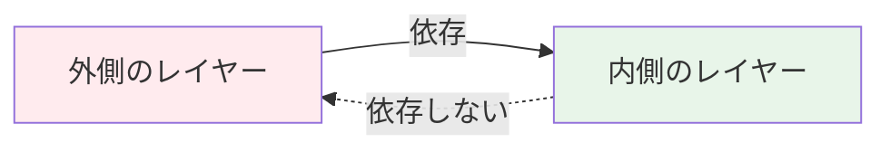

# レイヤー構造と依存関係

## はじめに

このレッスンでは、**クリーンアーキテクチャ**のレイヤー構造と依存関係について詳しく学びます。

## 4つのレイヤー

クリーンアーキテクチャは、4つの主要なレイヤーで構成されます：

### 1. エンティティ層（Entities）

エンタープライズ全体のビジネスルールを含む最も内側のレイヤーです。

**特徴:**
- アプリケーション固有のルールを含まない
- 他のレイヤーに依存しない
- 最も安定したレイヤー

**例:**
- ユーザーエンティティ
- 商品エンティティ
- 注文エンティティ

### 2. ユースケース層（Use Cases）

アプリケーション固有のビジネスルールを含むレイヤーです。

**特徴:**
- エンティティ層に依存
- アプリケーションの具体的な動作を定義
- 外部の技術的詳細に依存しない

**例:**
- ユーザー登録ユースケース
- 商品購入ユースケース
- 注文確認ユースケース

### 3. インターフェース・アダプター層（Interface Adapters）

データの変換を行うレイヤーです。

**特徴:**
- ユースケース層とエンティティ層に依存
- 外部の形式を内部の形式に変換
- コントローラー、プレゼンター、ゲートウェイを含む

**例:**
- REST APIコントローラー
- データベースゲートウェイ
- ビュー（プレゼンター）

### 4. フレームワーク・ドライバー層（Frameworks & Drivers）

外部の技術的詳細を含む最も外側のレイヤーです。

**特徴:**
- 他のすべてのレイヤーに依存
- フレームワーク、データベース、UIを含む
- 最も変更されやすいレイヤー

**例:**
- Reactコンポーネント
- PostgreSQLデータベース
- Express.jsフレームワーク

## 依存関係の方向

クリーンアーキテクチャでは、依存関係は常に内側に向かいます：



この原則により、以下の利点が得られます：

- **独立性**: 内側のレイヤーは外側の変更の影響を受けない
- **テスト容易性**: 各レイヤーを独立してテスト可能
- **保守性**: 変更の影響範囲が限定的

## 実践例

```typescript
// エンティティ層（内側）
interface User {
  id: string;
  name: string;
}

// ユースケース層
class CreateUserUseCase {
  execute(userData: User): User {
    // ビジネスロジック
    return user;
  }
}

// インターフェース層
class UserController {
  constructor(private useCase: CreateUserUseCase) {}
  
  async createUser(req: Request): Promise<Response> {
    const user = await this.useCase.execute(req.body);
    return Response.json(user);
  }
}
```

## まとめ

- クリーンアーキテクチャは4つのレイヤーで構成される
- 依存関係は常に内側に向かう
- この構造により、テスト容易性と保守性が向上する
