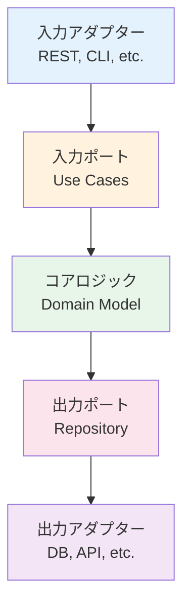

# ヘキサゴナルアーキテクチャの概念

## はじめに

このレッスンでは、**ヘキサゴナルアーキテクチャ**（ポート・アダプターパターン）の基本概念について学びます。

## ヘキサゴナルアーキテクチャとは

**ヘキサゴナルアーキテクチャ**は、Alistair Cockburnが提唱したアーキテクチャパターンです。アプリケーションのコアロジックを外部の技術的詳細から分離することを目的としています。

### 主な特徴

- **ポートとアダプター**: ポート（インターフェース）とアダプター（実装）で構成
- **技術的詳細からの分離**: コアロジックが技術的詳細に依存しない
- **テスト容易性**: アダプターをモックしてテスト可能

## ポートとアダプター

### ポート（Port）

ポートは、アプリケーションのコアロジックと外部システムを接続するためのインターフェースです。

**種類:**
- **入力ポート（Driving Port）**: アプリケーションを駆動するポート（例: REST API、CLI）
- **出力ポート（Driven Port）**: アプリケーションが使用するポート（例: データベース、外部API）

### アダプター（Adapter）

アダプターは、ポートの実装です。外部システムとの実際の接続を担当します。

**種類:**
- **入力アダプター（Driving Adapter）**: 入力ポートを実装（例: RESTコントローラー）
- **出力アダプター（Driven Adapter）**: 出力ポートを実装（例: データベースリポジトリ）

## アーキテクチャ図



## 実践例

```typescript
// ポート（インターフェース）
interface UserRepository {
  findById(id: string): Promise<User>;
  save(user: User): Promise<void>;
}

// アダプター（実装）
class PostgreSQLUserRepository implements UserRepository {
  async findById(id: string): Promise<User> {
    // PostgreSQLへのアクセス
  }
  
  async save(user: User): Promise<void> {
    // PostgreSQLへの保存
  }
}

// コアロジック
class UserService {
  constructor(private repository: UserRepository) {}
  
  async getUser(id: string): Promise<User> {
    return await this.repository.findById(id);
  }
}
```

## まとめ

- **ヘキサゴナルアーキテクチャ**はポートとアダプターで構成される
- コアロジックを外部の技術的詳細から分離
- テスト容易性と保守性が向上
