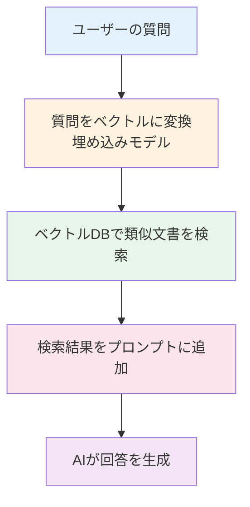

# AIアプリケーションにおけるベクトルDB

## はじめに

このレッスンでは、**AIアプリケーション**において**ベクトルDB**をどのように活用するかを学びます。

## RAG（Retrieval-Augmented Generation）

**RAG**は、ベクトルDBを使用して関連文書を検索し、それをプロンプトに追加してAIの回答精度を向上させる手法です。

### RAGの流れ



### 実装例

```typescript
class RAGService {
  constructor(
    private vectorDB: VectorDB,
    private embeddingModel: EmbeddingModel,
    private aiService: AIService
  ) {}
  
  async answer(question: string): Promise<string> {
    // 1. 質問をベクトルに変換
    const queryVector = await this.embeddingModel.embed(question);
    
    // 2. 類似文書を検索
    const relevantDocs = await this.vectorDB.search(queryVector, { topK: 5 });
    
    // 3. プロンプトを構築
    const context = relevantDocs.map(doc => doc.text).join('\n\n');
    const prompt = `以下の文書を参考に、質問に答えてください。

文書:
${context}

質問: ${question}`;
    
    // 4. AIが回答を生成
    return await this.aiService.generate(prompt);
  }
}
```

## セマンティック検索

ベクトルDBを使用して、意味に基づく検索を実現します。

### 従来の検索との違い

- **キーワード検索**: 文字列の一致を検索
- **セマンティック検索**: 意味の類似性を検索

**例:**
- キーワード検索: "AI" → "AI"を含む文書のみ
- セマンティック検索: "AI" → "機械学習"、"深層学習"なども検索

## チャットボットへの応用

ベクトルDBを使用して、チャットボットの知識ベースを構築します。

```typescript
class ChatbotService {
  async handleMessage(message: string, conversationHistory: string[]): Promise<string> {
    // 会話履歴を含めてベクトル化
    const context = conversationHistory.join('\n') + '\n' + message;
    const queryVector = await this.embeddingModel.embed(context);
    
    // 関連する知識を検索
    const knowledge = await this.vectorDB.search(queryVector, { topK: 3 });
    
    // プロンプトを構築
    const prompt = this.buildPrompt(message, knowledge, conversationHistory);
    
    // AIが回答を生成
    return await this.aiService.generate(prompt);
  }
}
```

## ベクトルDBの設計

### インデックスの選択

- **HNSW**: 高速な近似最近傍検索
- **IVF**: 大規模データセットに適している
- **Flat**: 正確な検索が必要な場合

### メタデータの活用

ベクトルと一緒にメタデータを保存し、フィルタリングに活用します。

```typescript
await vectorDB.upsert({
  id: 'doc1',
  vector: [0.1, 0.2, ...],
  metadata: {
    category: 'AI',
    author: 'Alice',
    createdAt: '2024-01-01'
  }
});

// メタデータでフィルタリング
const results = await vectorDB.search(queryVector, {
  topK: 10,
  filter: { category: 'AI' }
});
```

## まとめ

- **RAG**により、ベクトルDBで関連文書を検索してAIの回答精度を向上
- **セマンティック検索**により、意味に基づく検索が可能
- チャットボットや知識ベースの構築に有効
