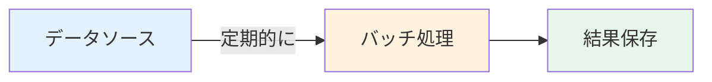
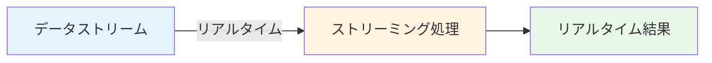

# データフローの全体像

## はじめに

このレッスンでは、**データフロー**の全体像について学びます。

## データフローとは

**データフロー**は、データがシステム内をどのように流れるかを表す概念です。

### データフローの基本要素

- **データソース**: データの発生源
- **データ処理**: データの変換・加工
- **データストレージ**: データの保存先
- **データ消費**: データの利用

## データフローのパターン

### 1. バッチ処理

定期的にデータを一括処理します。

**特徴:**
- 大量データの処理に適している
- レイテンシは高いが、スループットは高い

### 2. ストリーミング処理

データをリアルタイムで処理します。

**特徴:**
- 低レイテンシ
- リアルタイム性が重要

### 3. ハイブリッド

バッチ処理とストリーミング処理を組み合わせます。

## AI開発におけるデータフロー

AI開発においても、適切なデータフロー設計が重要です：

- **学習データの収集**: データソースから学習データを収集
- **データの前処理**: データのクリーニング、変換
- **モデルの学習**: 処理済みデータでモデルを学習
- **推論**: 学習済みモデルで推論を実行
- **結果の保存**: 推論結果を保存

## まとめ

- **データフロー**はデータがシステム内をどのように流れるかを表す
- バッチ処理、ストリーミング処理、ハイブリッドのパターンがある
- AI開発においても、適切なデータフロー設計が重要
