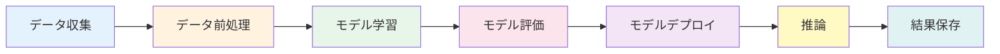

# AIシステムにおけるデータフロー設計

## はじめに

このレッスンでは、**AIシステム**における**データフロー設計**について学びます。

## AIシステムのデータフロー

AIシステムでは、以下のようなデータフローが考えられます：



### 各段階の詳細

1. **データ収集**: 学習データや推論データを収集
2. **データ前処理**: データのクリーニング、正規化、特徴量抽出
3. **モデル学習**: 前処理済みデータでモデルを学習
4. **モデル評価**: 学習済みモデルの性能を評価
5. **モデルデプロイ**: 学習済みモデルを本番環境にデプロイ
6. **推論**: 本番環境で推論を実行
7. **結果保存**: 推論結果を保存

## バッチ処理とリアルタイム処理

### バッチ処理

定期的にデータを一括処理します。

**用途:**
- モデルの学習
- 大量データの前処理
- レポート生成

### リアルタイム処理

データをリアルタイムで処理します。

**用途:**
- リアルタイム推論
- ストリーミングデータの処理
- 即座のフィードバック

## データフロー設計の考慮事項

### 1. スケーラビリティ

大量のデータを処理できるように設計します。

### 2. レイテンシ

リアルタイム処理では、低レイテンシが重要です。

### 3. データの品質

データの品質を保証する仕組みを組み込みます。

### 4. エラーハンドリング

エラーが発生した場合の処理を設計します。

## 実践例

```typescript
// データフローの実装例
class AIDataPipeline {
  async processData(data: RawData): Promise<ProcessedData> {
    // 1. データの前処理
    const cleanedData = await this.cleanData(data);
    
    // 2. 特徴量抽出
    const features = await this.extractFeatures(cleanedData);
    
    // 3. モデルで推論
    const predictions = await this.model.predict(features);
    
    // 4. 結果の保存
    await this.saveResults(predictions);
    
    return predictions;
  }
}
```

## まとめ

- AIシステムでは、データ収集から結果保存まで一連のデータフローを設計
- バッチ処理とリアルタイム処理を使い分ける
- スケーラビリティ、レイテンシ、データ品質、エラーハンドリングを考慮
