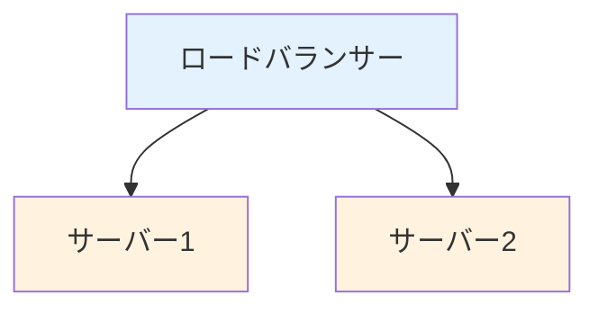

# 水平スケーリングと垂直スケーリング

## はじめに

このレッスンでは、**水平スケーリング**と**垂直スケーリング**の詳細について学びます。

## 水平スケーリング（スケールアウト）

### 特徴

- **サーバー数を増やす**: 複数のサーバーで負荷を分散
- **無制限のスケーリング**: 理論上、無制限にスケール可能
- **コスト効率**: 小規模なサーバーを複数使用

### 実装要件

- **ロードバランサー**: リクエストを複数のサーバーに分散
- **セッション管理**: ステートレスな設計、または共有セッションストア
- **データの一貫性**: 分散データベース、キャッシュの同期

### 例



## 垂直スケーリング（スケールアップ）

### 特徴

- **サーバー性能を上げる**: CPU、メモリ、ストレージを増強
- **実装が簡単**: 既存のシステムをそのまま使用可能
- **物理的制限**: ハードウェアの上限がある

### 実装要件

- **ハードウェアのアップグレード**: CPU、メモリの増強
- **OSの最適化**: リソースの効率的な利用

### 例

```
Before: 4コア、8GB RAM
After:  16コア、64GB RAM
```

## 使い分け

### 水平スケーリングが適している場合

- 大量のリクエストを処理する必要がある
- コスト効率を重視する
- 無制限のスケーリングが必要

### 垂直スケーリングが適している場合

- 単一のサーバーで処理できる範囲内
- 実装の簡素化を重視する
- ステートフルなアプリケーション

## AI開発における適用

### 水平スケーリング

- **推論サーバー**: 複数の推論サーバーで負荷を分散
- **学習クラスター**: 複数のGPUサーバーで分散学習

### 垂直スケーリング

- **高性能GPUサーバー**: 大規模モデルの学習
- **メモリ集約的な処理**: 大量のデータをメモリに保持

## まとめ

- **水平スケーリング**はサーバー数を増やす
- **垂直スケーリング**はサーバー性能を上げる
- 用途に応じて適切な方法を選択する
