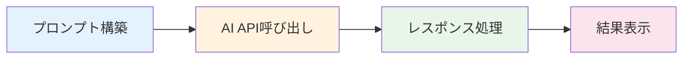
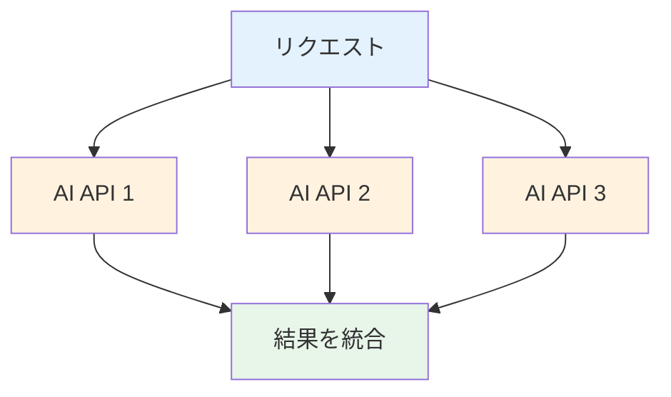
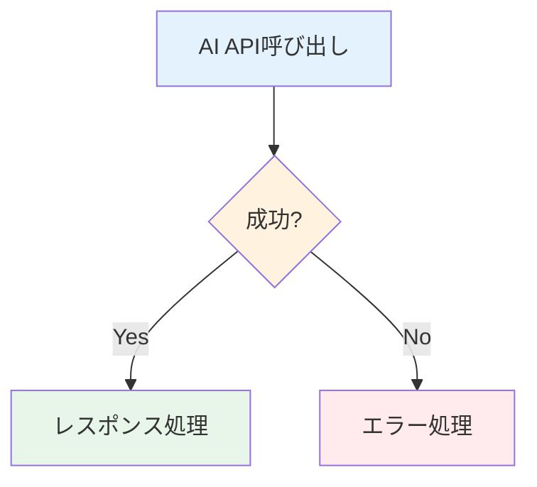
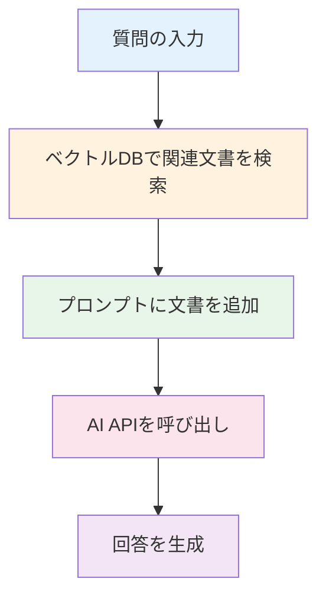

# AIワークフローパターン

## はじめに

このレッスンでは、**AIワークフローパターン**について学びます。

## AIワークフローパターン

### 1. シーケンシャルパターン

ステップを順番に実行します。

**例:**



### 2. パラレルパターン

複数のステップを並列に実行します。

**例:**



### 3. 条件分岐パターン

条件に応じて異なるステップを実行します。

**例:**



### 4. ループパターン

ステップを繰り返し実行します。

**例:**
```
プロンプト構築 → AI API呼び出し → 品質チェック → 不十分？ → プロンプト改善 → 繰り返し
```

## AI開発におけるパターンの適用

### 1. RAGワークフロー

RAG（Retrieval-Augmented Generation）のワークフローです。

**例:**



### 2. コードレビューワークフロー

コードレビューのワークフローです。

**例:**
```
1. コードの入力
2. AIがコードを分析
3. 問題点を検出
4. 改善案を提案
5. 人間がレビュー
```

## まとめ

- **AIワークフローパターン**には、シーケンシャル、パラレル、条件分岐、ループがある
- RAGやコードレビューなどのワークフローに適用可能
